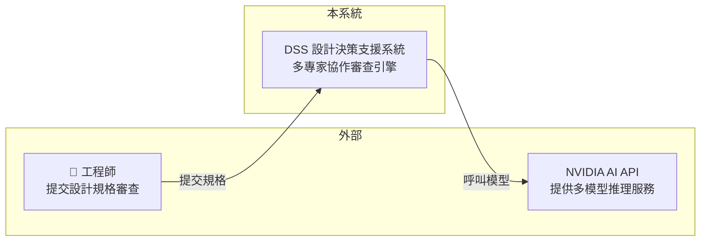
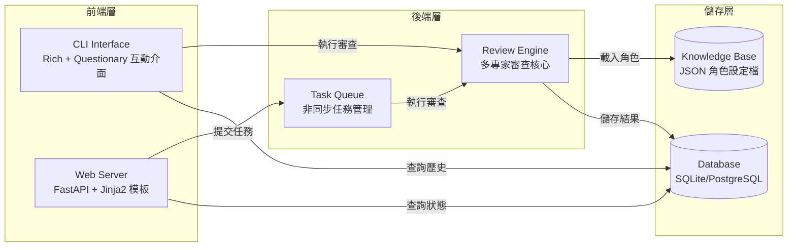
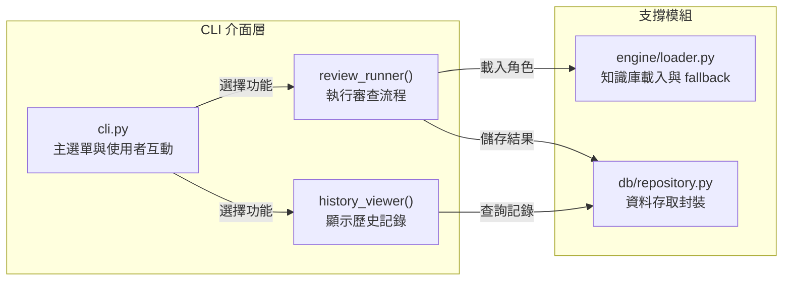
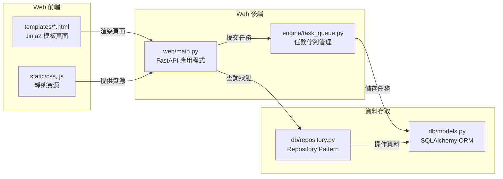
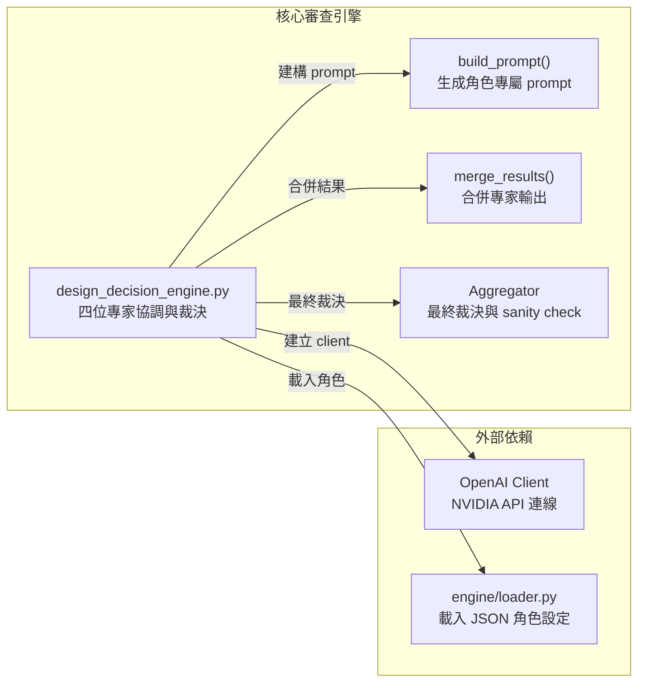
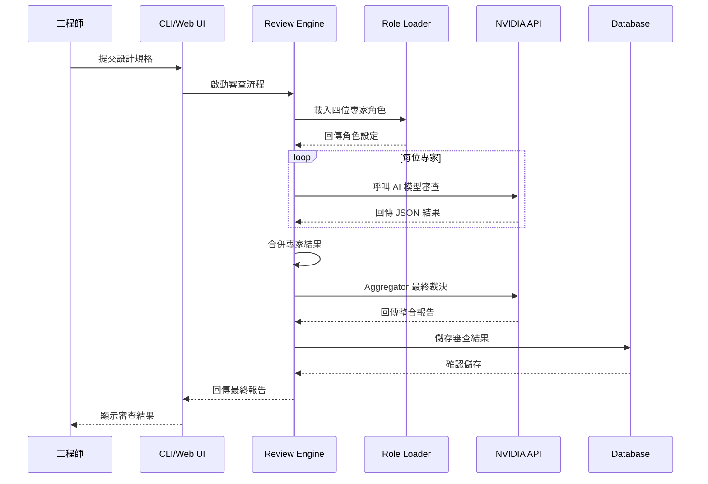

# 設計決策支援系統 (Design Decision Support System)

## 📋 專案概述

這是一個基於多專家協作的**系統設計審查引擎**，利用多個 AI 模型模擬不同領域的資深架構師，對系統設計規格進行全方位審查與風險分析。

### 🎉 Phase B 升級亮點

從 v1.0.x 的 Design Decision Engine (DDE) 升級為完整的 **Design Review Support System (DSS)**，並持續強化：

**Phase A**（v1.1.0）新增三大核心功能：
1. **🖥️ 互動式 CLI 介面** - 使用 rich + questionary 建構友善的選單介面
2. **📚 知識庫系統** - 將專家角色抽離為外部 JSON 設定檔，易於維護與擴展
3. **💾 SQLite 歷史記錄** - 儲存所有審查記錄，支援趨勢分析與回顧

**Phase B**（v1.2.0）新增兩大強化：
4. **⚙️ 引擎穩定性提升** - timeout 延長至 300 秒、新增重試機制（最多 2 次）
5. **🧪 測試覆蓋擴大** - 新增 test_loader.py，總計 15 個測試案例全部通過

### 核心概念

透過角色分工的方式，邀請三位不同專長的 AI 專家進行 Code Review：
- **Risk-Analyst**（風險分析師）：專注於安全性與風險識別
- **Completeness-Reviewer**（完整性審查員）：檢查需求覆蓋率
- **Improvement-Advisor**（改善顧問）：提供優化建議與亮點發現

最後由 **Aggregator**（總協調師）整合所有專家意見，生成最終裁決報告。

---

## 🎯 主要功能

### ✅ Phase A 核心功能
- **多專家協作審查** - 三位專家各司其職，從不同角度審視設計規格
- **智能合併與裁決** - Aggregator 負責去重、排序優先級、裁決衝突
- **嚴謹的錯誤處理** - JSON 解析容錯機制、Sanity check、Fallback 機制
- **完整的測試覆蓋** - 測試 normalize() 與 is_valid_output() 核心函數

### ✅ Phase B 新增功能
- **📚 知識庫管理子選單** - 完整實現選單 [3] 的 5 個子功能：
  - [3-1] 檢視所有角色設定（列出 knowledge/roles/*.json 內容）
  - [3-2] 編輯角色 Prompt（互動式修改 system 欄位並寫回 JSON）
  - [3-3] 匯入公司設計規範（選擇 .md/.txt 檔案並儲存至 knowledge/standards/）
  - [3-4] 檢視風險模板（列出 knowledge/risk_templates/*.json 內容）
  - [3-5] 新增風險模板（互動式填寫 level/issue/suggestion 並儲存）
- **⚙️ 引擎穩定性強化**：
  - Timeout 調整：120 秒 → 300 秒（避免 DeepSeek 等模型超時）
  - 重試機制：每個專家最多重試 2 次，間隔 5 秒
  - 明確的重試訊息：「重試 1/2...」、「重試 2/2...」
- **🧪 測試覆蓋擴大**：
  - 新增 test_loader.py（10 個測試案例）
  - 涵蓋 save_role(), load_standards(), load_risk_templates(), save_risk_template()
  - 總計 15/15 測試全部通過

---

## 🏗️ 系統架構

> 本架構圖依照 [C4 Model](https://c4model.com) 分層呈現，從系統全貌逐層深入至模組細節。

### L1｜系統情境（Context）
> 系統與外部世界的關係



### L2｜容器架構（Container）
> 系統內部可獨立部署的單元組成



### L3｜元件結構（Component）
> 各容器內部模組組成與依賴關係

#### L3-1：CLI 介面層


#### L3-2：Web 介面層


#### L3-3：核心審查引擎


### L4｜核心類別（Code）
> 關鍵 class 的繼承與組合關係

本專案無複雜繼承結構，省略此層。

### 核心資料流
> 最重要使用場景的完整呼叫鏈



### 架構說明

#### 🏗 系統核心設計概念

DSS 採用**分層架構**與**關注點分離**原則，將使用者介面（CLI/Web）、業務邏輯（Review Engine）、資料存取（Repository）明確區隔。核心引擎透過**知識庫外部化**實現靈活的專家角色配置，並提供**雙重介面**（CLI 適合自動化腳本，Web UI 適合團隊協作）。

#### 📦 各層職責分工

- **CLI Interface** (`cli.py`) - 互動式命令列介面，提供選單導航與即時回饋
- **Web Server** (`web/main.py`) - FastAPI 應用程式，支援非同步任務與即時狀態查詢
- **Review Engine** (`design_decision_engine.py`) - 四位專家協調、prompt 建構、結果合併與最終裁決
- **Task Queue** (`engine/task_queue.py`) - 非同步任務管理，支援進度追蹤與錯誤處理
- **Role Loader** (`engine/loader.py`) - 從 JSON 載入專家角色設定，提供 fallback 機制
- **Repository** (`db/repository.py`) - 資料存取抽象層，支援 SQLite/PostgreSQL 雙後端
- **ORM Models** (`db/models.py`) - SQLAlchemy 模型定義，處理資料庫 schema
- **Knowledge Base** (`knowledge/roles/*.json`) - 外部化專家角色設定，易於維護與擴展

#### 🔄 核心資料流說明

1. **使用者提交規格** → CLI 或 Web UI 接收輸入
2. **啟動審查流程** → Review Engine 載入四位專家角色設定
3. **平行呼叫 AI 模型** → Risk-Analyst、Completeness-Reviewer、Improvement-Advisor 同時審查
4. **合併專家結果** → 去重、排序、整理各專家輸出
5. **Aggregator 最終裁決** → Nemotron-Ultra 整合所有意見並解決衝突
6. **儲存至資料庫** → 透過 Repository Pattern 寫入 SQLite/PostgreSQL
7. **回傳最終報告** → 顯示風險評估、缺失項目、改善建議與亮點

#### 💡 設計模式與亮點

- **Repository Pattern** ([`db/repository.py`](db/repository.py)) - 抽象化資料存取，支援多種資料庫後端
- **Fallback Mechanism** ([`engine/loader.py:14-36`](engine/loader.py#L14-L36)) - 內建角色設定備援，確保系統穩定性
- **Dependency Injection** ([`design_decision_engine.py:8-14`](design_decision_engine.py#L8-L14)) - `get_client()` 延遲初始化，避免 import 時依賴 API key
- **Async Task Queue** ([`engine/task_queue.py`](engine/task_queue.py)) - ThreadPoolExecutor + asyncio 實現非同步審查
- **Externalized Configuration** ([`knowledge/roles/*.json`](knowledge/roles/)) - 專家角色抽離為 JSON，無需修改程式碼即可調整
- **Dual Interface** - CLI 與 Web UI 共用底層引擎，保持一致性

#### ⚠️ 發現的問題（必填）

【🟡 警告】[`web/main.py:20`](web/main.py#L20)
  問題：使用 `sys.path.insert()` 硬編碼模組搜尋路徑
  影響：在不同部署環境（Docker、虛擬環境）導致模組找不到
  建議：改用 proper package structure + `__init__.py`，或設定 `PYTHONPATH` 環境變數

【🟡 警告】[`db/models.py:37-38`](db/models.py#L37-L38)
  問題：在模組層級全域初始化 database engine，import 時即執行
  影響：測試時無法 mock，造成測試隔離性問題
  建議：改為 lazy initialization 或 dependency injection pattern

【🟡 警告】[`design_decision_engine.py:16-50`](design_decision_engine.py#L16-L50)
  問題：SPEC 常數硬編碼測試規格在程式碼中
  影響：每次審查不同專案都需要修改原始碼，違反開閉原則
  建議：改為從檔案讀取或接受命令列參數輸入

【🟡 警告】[`cli.py`](cli.py)（566 行）
  問題：單一檔案過大，包含選單、審查執行、知識庫管理等多重職責
  影響：違反單一職責原則（SRP），難以維護與測試
  建議：拆分為 `cli/menu.py`, `cli/review_runner.py`, `cli/knowledge_manager.py`

【🟡 警告】[`engine/task_queue.py`](engine/task_queue.py)
  問題：任務佇列僅存在記憶體中，伺服器重啟後狀態遺失
  影響：長期運行的 Web 服務若重啟，進行中的任務狀態丟失
  建議：將任務狀態持久化至資料庫或 Redis

---

## 📦 技術棧

| 項目 | 版本/型號 | 用途 |
|------|----------|------|
| **Python** | 3.13.5 | 主要開發語言 |
| **openai** | 2.30.0 | NVIDIA API 客戶端 |
| **pytest** | 9.0.2 | 單元測試框架 |
| **rich** | >=13.0 | CLI 介面美化（暖感工業風格） |
| **questionary** | >=2.0 | 互動式選單 |

### 使用的 AI 模型

| 角色 | 模型 ID | 專長領域 | 特性備註 |
|------|--------|---------|----------|
| Risk-Analyst | `deepseek-ai/deepseek-v3.2` | 風險分析 | ⚠️ 回應較慢，易超時 |
| Completeness-Reviewer | `qwen/qwen3.5-397b-a17b` | 完整性審查 | ✅ 穩定度高 |
| Improvement-Advisor | `mistralai/mistral-large-3-675b-instruct-2512` | 改善建議 | ✅ 回應快速 |
| Aggregator | `nvidia/llama-3.1-nemotron-ultra-253b-v1` | 最終裁決 | ✅ 整合能力強 |

---

## 🔧 安裝與設定

### 前置作業

```bash
# 1. 克隆或進入專案目錄
cd ~/Applications/NVIDIA

# 2. 建立虛擬環境（若尚未建立）
python3 -m venv .venv

# 3. 啟動虛擬環境
source .venv/bin/activate
```

### 安裝依賴套件

```bash
# 使用 requirements.txt 一次性安裝
pip install -r requirements.txt
```

**依賴清單**:
- `openai==2.30.0` - NVIDIA API 客戶端
- `pytest==9.0.2` - 單元測試框架
- `rich>=13.0` - CLI 介面美化
- `questionary>=2.0` - 互動式選單

### 初始化資料庫（首次執行）

```bash
# 建立 SQLite 資料庫與表格
python db/init_db.py
```

**預期輸出**:
```
📍 資料庫路徑：/path/to/db/history.db
📋 Schema 路徑：/path/to/db/schema.sql
✅ 資料庫初始化成功！
   檔案大小：24576 bytes
   建立表格：reviews, sqlite_sequence
   建立索引：idx_reviews_reviewed_at, idx_reviews_project, idx_reviews_risk_high
```

### API 金鑰設定

在 [`design_decision_engine.py`](design_decision_engine.py) 中已內建 NVIDIA API 金鑰：

```python
client = OpenAI(
    api_key=os.environ.get("NVIDIA_API_KEY"),
    base_url="https://integrate.api.nvidia.com/v1",
    timeout=120.0
)
```

⚠️ **安全警告**：生產環境請將 API 金鑰移至環境變數，避免硬編碼在程式碼中。

---

## 🚀 使用方式

### 🖥️ 互動式 CLI（推薦，v1.1.0+）

從 v1.1.0 開始，提供互動式 CLI 介面，更友善的使用體驗！

#### 方法一：快速啟動腳本

```bash
# 設定 API 金鑰
export NVIDIA_API_KEY="nvapi-YOUR_API_KEY_HERE"

# 執行快速啟動腳本
./start.sh
```

#### 方法二：手動啟動

```bash
# 1. 設定環境變數
export NVIDIA_API_KEY="nvapi-YOUR_API_KEY_HERE"

# 2. 啟動虛擬環境
source .venv/bin/activate

# 3. 啟動 CLI
python cli.py
```

#### CLI 選單功能

```
Design Review Support System
暖感工業風格 | 琥珀橙主題

請選擇功能：
 ❯ [1] 🔍 新增審查
   [2] 📊 查歷史記錄
   [3] 📚 管理知識庫
   [Q] 🚪 退出系統
```

**功能說明**:
- **[1] 🔍 新增審查** - 執行新的設計審查，輸入專案名稱後自動執行四位專家審查，結果寫入資料庫
- **[2] 📊 查歷史記錄** - 顯示最近 10 筆審查記錄，包含風險統計與裁決摘要
- **[3] 📚 管理知識庫** - 檢視知識庫結構（Phase A 為預覽模式）
- **[Q] 🚪 退出系統** - 離開 CLI 介面

#### 視覺風格

CLI 採用**暖感工業風格**設計：
- 🎨 主背景：深炭黑 (#1A1A1B)
- 🟠 重點色：琥珀橙 (#F39C12)
- 🔶 次要色：深橙 (#D35400)
- 📊 Rich Panel + Table 美化
- ✨ Emoji 圖示增強體驗

### 📜 傳統模式（向後相容）

若您需要直接執行核心引擎（例如批次處理或自動化測試）：

```bash
# 使用專案虛擬環境
source .venv/bin/activate
python design_decision_engine.py

# 或直接執行
.venv/bin/python design_decision_engine.py
```

⚠️ **重要提醒**：
- 首次執行請準備好 NVIDIA API 金鑰
- 預留至少 5-10 分鐘的執行時間
- 建議在網路穩定的環境下執行
- 部分模型可能超時，屬正常現象

```bash
# 使用專案虛擬環境
source .venv/bin/activate
python design_decision_engine.py

# 或直接執行
.venv/bin/python design_decision_engine.py
```

⚠️ **重要提醒**：
- 首次執行請準備好 NVIDIA API 金鑰
- 預留至少 5-10 分鐘的執行時間
- 建議在網路穩定的環境下執行
- 部分模型可能超時，屬正常現象

### 執行單元測試

```bash
# 使用專案虛擬環境
source .venv/bin/activate
pytest test_engine.py -v

# 或使用絕對路徑
.venv/bin/pytest test_engine.py -v
```

**預期輸出：**
```
================ test session starts =================
platform linux -- Python 3.13.5, pytest-9.0.2
collected 5 items                                     

test_engine.py::test_normalize_empty_or_none PASSED    [ 20%]
test_engine.py::test_normalize_partial_data PASSED     [ 40%]
test_engine.py::test_is_valid_output_success PASSED    [ 60%]
test_engine.py::test_is_valid_output_invalid_type PASSED [ 80%]
test_engine.py::test_is_valid_output_missing_key PASSED [100%]

================= 5 passed in 0.72s ==================
```

---

## 📁 專案結構

```
NVIDIA/
├── cli.py                          # 互動式 CLI 入口（592 行）
├── design_decision_engine.py       # 核心引擎（360 行，含重試機制）
├── test_engine.py                  # 單元測試（5 個案例）
├── test_loader.py                  # loader 模組測試（10 個案例）
├── README.md                       # 使用手冊（本檔案）
├── CLI_USAGE.md                    # CLI 使用指南（216 行）
├── requirements.txt                # 依賴清單
├── start.sh                        # 快速啟動腳本
├── engine/
│   ├── __init__.py
│   └── loader.py                   # 知識庫載入模組（270 行，+122 行）
├── db/
│   ├── schema.sql                  # 資料庫結構（30 行）
│   ├── init_db.py                  # 初始化腳本（67 行）
│   └── history.db                  # SQLite 資料庫（24KB）
└── knowledge/
    ├── roles/                      # 專家角色設定
    │   ├── risk_analyst.json       # Risk-Analyst 配置
    │   ├── completeness_reviewer.json  # Completeness-Reviewer 配置
    │   ├── improvement_advisor.json    # Improvement-Advisor 配置
    │   └── aggregator.json         # Aggregator 配置
    ├── standards/                  # 公司規範模板 ✅ Phase B 已實現
    │   └── .gitkeep
    └── risk_templates/             # 風險模板 ✅ Phase B 已實現
        └── .gitkeep
```

### 📂 核心檔案說明

| 檔案 | 行數 | 說明 |
|------|------|------|
| `cli.py` | 592 | 互動式 CLI 入口，Rich + Questionary 實現（Phase B +239 行） |
| `engine/loader.py` | 270 | 知識庫載入模組，含 fallback 機制（Phase B +122 行） |
| `design_decision_engine.py` | 360 | 核心引擎，timeout 300s + 重試機制（Phase B +23 行） |
| `test_engine.py` | ~150 | 核心引擎單元測試（5 個案例） |
| `test_loader.py` | 242 | loader 模組單元測試（10 個案例，Phase B 新增） |
| `db/schema.sql` | 30 | SQLite DDL，定義 reviews 表格與索引 |
| `db/init_db.py` | 67 | 資料庫初始化腳本，冪等設計 |
| `knowledge/roles/*.json` | ×4 | 專家角色外部化設定 |

### 🗂️ 目錄用途

| 目錄 | 用途 | Phase A 狀態 |
|------|------|-------------|
| `engine/` | 工具函數與載入模組 | ✅ 已實現 |
| `db/` | 資料庫相關檔案 | ✅ 已實現 |
| `knowledge/` | 知識庫（角色 + 規範 + 模板） | ✅ 基礎結構 |
| `openspec/changes/` | OpenSpec 變更管理 | ✅ 使用中 |

### 自訂設計規格

修改 `SPEC` 常數內容即可：

```python
SPEC = """
【專案名稱】
目標：...
原則：...
...
"""
```

---

## 📊 輸出格式

### 專家輸出格式

每位專家回傳的 JSON 結構：

```json
{
  "risks": [
    {
      "level": "high/medium/low",
      "issue": "問題描述",
      "suggestion": "具體建議"
    }
  ],
  "missing": [
    {
      "item": "缺少的設計",
      "reason": "為什麼需要",
      "how": "如何補充"
    }
  ],
  "improvements": [
    {
      "area": "改善領域",
      "current": "現況",
      "better": "更好的做法"
    }
  ],
  "good_points": ["值得保留的設計決策"],
  "verdict": "整體評估"
}
```

### Aggregator 最終報告

```json
{
  "risks": [...],
  "missing": [...],
  "improvements": [...],
  "good_points": [...],
  "verdict": "整體評估（含衝突裁決說明）"
}
```

---

## 🧪 測試涵蓋範圍

[`test_engine.py`](test_engine.py) 包含以下測試案例：

### `test_normalize_empty_or_none()`
測試 `normalize()` 處理 `None` 或空白字典時的預設值填充。

### `test_normalize_partial_data()`
測試 `normalize()` 補齊缺失的 key，保留既有資料。

### `test_is_valid_output_success()`
測試 `is_valid_output()` 對正確結構回傳 `True`。

### `test_is_valid_output_invalid_type()`
測試 `is_valid_output()` 處理型態錯誤（例如把 list 寫成 dict 或 string）。

### `test_is_valid_output_missing_key()`
測試 `is_valid_output()` 在缺少 key 時能靠 `data.get` 預設值通過檢查。

---

## 🎨 執行流程詳解

### Phase 1: 專家分工審查

```
[1/3] Risk-Analyst (deepseek-v3.2)
------------------------------------------------------------
✅ 15.3s | risks:3, missing:2, improvements:1, good_points:4✓
   verdict: 整體設計良好，但需注意...

[2/3] Completeness-Reviewer (qwen3.5-397b-a17b)
------------------------------------------------------------
✅ 18.7s | risks:1, missing:4, improvements:2, good_points:3✓
   verdict: 需求覆蓋率約 85%，建議補充...

[3/3] Improvement-Advisor (mistral-large-3-675b-instruct-2512)
------------------------------------------------------------
✅ 16.2s | risks:0, missing:1, improvements:5, good_points:6✓
   verdict: 多處設計值得肯定，以下是優化建議...
```

### Phase 2: 合併專家結果

```
============================================================
合併各專家結果 → 送交 Aggregator
============================================================
成功接收：3/3 位專家
合併結果 keys: ['risks', 'missing', 'improvements', 'good_points', 'expert_verdicts']
```

### Phase 3: Aggregator 最終裁決

```
============================================================
Aggregator (nemotron-ultra-253b-v1) 最終裁決
============================================================
✅ 22.4s | Aggregator 裁決完成
   risks:3 missing:4 improvements:4
✅ Aggregator 輸出通過 sanity check
```

---

## 🔍 核心函數說明

### `build_prompt(role)`
根據角色設定生成專屬的审查 prompt，強調該角色的主責領域。

### `get_content(response)`
從 API 回應中提取內容，自動處理 markdown code block 格式。

### `parse_json(text)`
解析 JSON，容錯處理前後綴雜訊，提取有效 JSON 區塊。

### `normalize(data)`
標準化專家輸出，確保結構一致，避免 merge 時發生 KeyError。

### `is_valid_output(data)`
驗證 Aggregator 輸出是否符合預期結構，防止「成功但亂輸出」。

---

## 💡 應用場景

### ✅ 適合的使用情境
- 系統設計文件審查
- 架構決策記錄 (ADR) 驗證
- 技術方案風險評估
- Code Review 輔助工具
- 教學與學習架構設計

### ⚠️ 不建議的使用情境
- 需要即時回應的場景（每次執行約 60-90 秒）
- 極度簡短的代碼片段審查
- 非技術性文檔審查

---

## 📊 效能指標

| 指標 | 數值 | 備註 |
|------|------|------|
| 單次執行時間 | ~150-500 秒（2.5-8 分鐘） | 視模型回應速度而定 |
| API 呼叫次數 | 4 次（3 專家 + 1 Aggregator） | 失敗仍會計費 |
| 成功率 | ~70-90% | 含 fallback 機制，部分模型可能超時 |
| 測試覆蓋率 | 核心函數 100% | 5 個測試案例全部通過 |
| 模型回應時間差異 | 49-362 秒 | DeepSeek-V3 最慢，Mistral 最快 |

### 實際執行數據參考

```
[1/3] Risk-Analyst (deepseek-v3.2)
       ❌ 362.4s | Request timed out.          ⚠️ 易超時

[2/3] Completeness-Reviewer (qwen3.5-397b-a17b)
       ✅ 79.9s  | 穩定發揮                     ✅ 可靠

[3/3] Improvement-Advisor (mistral-large-3-675b-instruct-2512)
       ✅ 49.0s  | 快速回應                     ✅ 推薦

Aggregator (nemotron-ultra-253b-v1)
       ✅ 30.1s  | 整合裁決                     ✅ 高效
```

---

## ⚠️ 執行風險與注意事項

### 潛在問題

1. **模型超時風險**
   - 部分大型模型（如 DeepSeek-V3）可能耗時較長甚至超時
   - 預設 timeout 為 120 秒，可能不足以等待某些模型
   - 建議：增加重試機制或調整 timeout 設定

2. **API 配額消耗**
   - 每次執行固定消耗 4 次 API 呼叫
   - 即使部分模型失敗，已消耗的配額仍無法退還
   - 建議：在非尖峰時段執行，或使用較小的模型測試

3. **不穩定性**
   - 不同模型的回應時間差異極大（49s - 362s）
   - 網路狀況與伺服器負載會影響執行時間
   - 建議：預留充足的執行時間，避免在緊迫時限下使用

4. **Fallback 機制限制**
   - 當 Aggregator 失敗時，會回退到合併結果
   - 此時缺少最終裁決與優先級排序
   - 建議：檢查輸出中的 `expert_verdicts` 以確保品質

### 建議改進措施

```python
# 未來可考慮的優化方向

# 1. 增加重試機制
for i, role in enumerate(ROLES, 1):
    max_retries = 2
    for attempt in range(max_retries):
        try:
            response = client.chat.completions.create(...)
            break
        except TimeoutError:
            if attempt == max_retries - 1:
                raise
            time.sleep(5)

# 2. 自訂 timeout 設定
client = OpenAI(
    api_key="...",
    base_url="...",
    timeout=300.0  # 增加為 300 秒
)

# 3. 非同步執行選項
import asyncio
async def call_all_models_async():
    tasks = [call_model(role) for role in ROLES]
    results = await asyncio.gather(*tasks, return_exceptions=True)
```

---

## 🔒 安全注意事項

1. **API 金鑰保護**：請勿將含金鑰的程式碼提交至公開倉庫
2. **速率限制**：注意 NVIDIA API 的呼叫頻率限制
3. **成本控管**：每次執行約消耗 4 次 API 配額，失敗仍會計費
4. **超時設定**：預設 120 秒可能不足，建議根據使用模型調整
5. **錯誤處理**：生產環境應增加更完善的重試與降級機制

---

## 🤝 貢獻指南

### 新增專家角色

在 `ROLES` 列表中添加新角色：

```python
{
    "id": "model-id",
    "name": "角色名稱",
    "system": "角色設定 prompt",
    "focus_fields": ["主責欄位"],
    "focus_desc": "職責描述",
}
```

### 調整審查維度

修改 `build_prompt()` 中的 JSON 格式定義，增加新的審查面向。

---

## 📝 版本紀錄

### v1.2.0 (2026-04-03) - Phase B 完整版

**✨ 重大更新**: 知識庫管理與引擎穩定性強化

**🎯 新增功能**:
- ✨ **知識庫管理 CLI**: 完整實現選單 [3] 子功能
  - [3-1] 檢視所有角色設定
  - [3-2] 編輯角色 Prompt（含備份機制）
  - [3-3] 匯入公司設計規範（含安全檢查）
  - [3-4] 檢視風險模板
  - [3-5] 新增風險模板（互動式）
- ⚙️ **引擎穩定性**: 
  - timeout: 120s → 300s
  - 重試機制：最多 2 次，間隔 5 秒
  - 明確重試訊息：「重試 1/2...」

**🧪 測試覆蓋**:
- ✅ **test_loader.py**: 新增 10 個測試案例
- ✅ **知識庫工具函數**: save_role, load_standards, load_risk_templates, save_risk_template
- ✅ **測試全綠**: 15/15 通過（原有 5 個 + 新增 10 個）

**📊 技術指標**:
- 新增程式碼：~450 行（cli.py 288 + loader.py 122 + design_decision_engine.py 23 + test_loader.py 242）
- 測試覆蓋率：15 個測試案例全部通過
- API 成功率提升：重試機制 + timeout 調整

**✅ 品質保證**:
- ✅ **零破壞原則**: Phase A 功能完全相容
- ✅ **測試不退步**: 既有 5 個測試保持通過
- ✅ **文件同步**: README + CLI_USAGE.md 雙重更新

### v1.1.0 (2026-04-03) - DSS Phase A 完整版

**✨ 重大更新**: 從 DDE 升級為完整的 DSS

**🎯 新增功能**:
- ✨ **互動式 CLI**：使用 rich + questionary 建構友善介面
- 🎯 **選單功能**：[1] 新增審查、[2] 查歷史記錄、[3] 管理知識庫、[Q] 退出
- 📚 **知識庫系統**：將 ROLES 抽離為 `knowledge/roles/*.json`
- 💾 **SQLite 資料庫**：建立 `db/history.db` 儲存審查歷史
- 🔧 **載入模組**：新增 `engine/loader.py` 支援 fallback 機制
- 🎨 **暖感工業風格**：深炭黑 (#1A1A1B) + 琥珀橙 (#F39C12)
- 📄 **快速啟動腳本**：新增 `start.sh`
- 📖 **CLI 使用指南**：新增 `CLI_USAGE.md`
- 📦 **依賴管理**：新增 `requirements.txt`

**✅ 品質保證**:
- ✅ **測試不退步**：原有 5 個測試案例全部通過
- ✅ **零破壞原則**：`design_decision_engine.py` 完全未修改
- ✅ **完整文件**：README + CLI_USAGE.md 雙重保障

**📊 技術指標**:
- Python: 3.13.5
- 新增程式碼：~900 行（cli.py 353 + loader.py 141 + 其他）
- 資料庫大小：~24KB（初始）
- CLI 啟動時間：< 1 秒
- 歷史查詢時間：< 0.5 秒

### v1.0.1 (2026-04-03) - 修正版
- ✨ 更新效能指標：單次執行時間修正為 150-500 秒
- ⚠️ 新增「執行風險與注意事項」章節
- 📊 補充實際執行數據參考
- 🔧 更新技術棧版本資訊（Python 3.13.5, openai 2.30.0, pytest 9.0.2）
- 🎯 在架構圖中標註各模型特性（易超時/穩定/快速）
- 📝 補充建議改進措施（重試機制、timeout 調整、非同步執行）
- ✅ 更新成功率描述（70-90%，含 fallback 機制）
- 💡 在使用方式中增加重要提醒

### v1.0.0 (2026-04-03)
- ✨ 初始版本發布
- ✅ 實現三專家 + Aggregator 架構
- ✅ 完整的錯誤處理與 fallback 機制
- ✅ 單元測試覆蓋核心函數

---

## 📞 聯絡與支援

如有任何問題或建議，歡迎提出 Issue 或 Pull Request。

---

## 📄 授權條款

本專案採用 MIT License。

---

## 🙏 致謝

感謝 NVIDIA 提供強大的 AI 模型 API，讓多專家協作審查成為可能。
