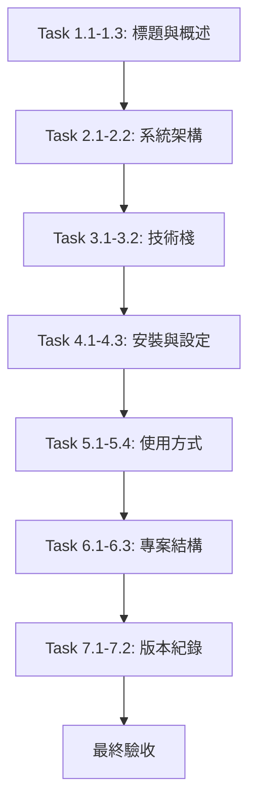

# nvidia-dde-readme-update - 實作任務清單

## 📋 任務總覽

**目標**: 更新 README.md 以反映 Phase A 的所有改動  
**預估工時**: 1.5 小時  
**任務數量**: 7 個主要階段（50 個子任務）  
**完成狀態**: ✅ 全部完成（50/50）

---

## 階段 1: 標題與概述更新 (預計 10 分鐘)

### Task 1.1: 更新專案標題
- [ ] 將 L1 從「設計決策引擎」改為「設計決策支援系統」
- [ ] 英文名稱從 "Design Decision Engine" 改為 "Design Decision Support System"

**驗收**:
```markdown
# 設計決策支援系統 (Design Decision Support System)
```

### Task 1.2: 新增 Phase A 升級亮點
- [ ] 在 L6 後插入「Phase A 升級亮點」小節
- [ ] 列出三大核心功能：CLI、知識庫、SQLite
- [ ] 使用 emoji 增強可讀性

**檔案內容**:
```markdown
### 🎉 Phase A 升級亮點

從 v1.0.x 的 Design Decision Engine (DDE) 升級為完整的 **Design Review Support System (DSS)**，新增三大核心功能：

1. **🖥️ 互動式 CLI 介面** - 使用 rich + questionary 建構友善的選單介面
2. **📚 知識庫系統** - 將專家角色抽離為外部 JSON 設定檔，易於維護與擴展
3. **💾 SQLite 歷史記錄** - 儲存所有審查記錄，支援趨勢分析與回顧
```

### Task 1.3: 更新核心概念章節
- [ ] 保留原有核心概念內容
- [ ] 確認描述與現有系統一致

---

## 階段 2: 系統架構更新 (預計 15 分鐘)

### Task 2.1: 新增 DSS 系統架構圖
- [ ] 在現有架構圖（L42-L82）後新增 DSS 層次圖
- [ ] 包含三層結構：CLI 層、支撐層、引擎層
- [ ] 使用 ASCII art 呈現

**架構圖內容**:
```
┌─────────────────────────────────────────────────────────┐
│                    cli.py (互動式入口)                   │
│   [1] 新增審查  [2] 查歷史  [3] 知識庫  [Q] 退出         │
└──────────────────────────┬──────────────────────────────┘
                           │
        ┌──────────────────┼──────────────────┐
        │                  │                  │
        ▼                  ▼                  ▼
┌───────────────┐  ┌───────────────┐  ┌───────────────┐
│  engine/      │  │  knowledge/   │  │  db/          │
│  loader.py    │  │  roles/       │  │  history.db   │
│  (載入模組)   │  │  standards/   │  │  (SQLite)     │
│  fallback 機制 │  │  risk_templates│ └───────────────┘
└───────┬───────┘  └───────────────┘
        │
        ▼
┌─────────────────────────────────────────────────────────┐
│        design_decision_engine.py (核心引擎)              │
│   Risk-Analyst + Completeness-Reviewer +                │
│   Improvement-Advisor + Aggregator                      │
└─────────────────────────────────────────────────────────┘
```

### Task 2.2: 新增架構層次說明
- [ ] 說明三層架構的職責
- [ ] 標註各層的代表檔案

---

## 階段 3: 技術棧更新 (預計 5 分鐘)

### Task 3.1: 更新技術棧表格
- [ ] 在 L85-L100 的表格中新增兩列
- [ ] 新增 `rich>=13.0`
- [ ] 新增 `questionary>=2.0`

**新增內容**:
```markdown
| **rich** | >=13.0 | CLI 介面美化（暖感工業風格） |
| **questionary** | >=2.0 | 互動式選單 |
```

### Task 3.2: 保留既有內容
- [ ] 確認 Python、openai、pytest 資訊仍然正確
- [ ] AI 模型表格保持不變

---

## 階段 4: 安裝與設定更新 (預計 10 分鐘)

### Task 4.1: 替換安裝指令
- [ ] 將 L109 的 `pip install openai pytest` 替換
- [ ] 改為使用 `requirements.txt`

**新內容**:
```bash
# 使用 requirements.txt 一次性安裝
pip install -r requirements.txt
```

### Task 4.2: 新增依賴清單說明
- [ ] 列出四個依賴套件
- [ ] 簡要說明每個套件的用途

### Task 4.3: 新增資料庫初始化步驟
- [ ] 在 API 金鑰設定前新增一節
- [ ] 說明如何執行 `python db/init_db.py`
- [ ] 提供預期輸出範例

**預期輸出**:
```
📍 資料庫路徑：/path/to/db/history.db
📋 Schema 路徑：/path/to/db/schema.sql
✅ 資料庫初始化成功！
   檔案大小：24576 bytes
   建立表格：reviews, sqlite_sequence
   建立索引：idx_reviews_reviewed_at, idx_reviews_project, idx_reviews_risk_high
```

---

## 階段 5: 使用方式更新 (預計 20 分鐘)

### Task 5.1: 新增 CLI 章節
- [ ] 在 L128 新增「互動式 CLI（推薦，v1.1.0+）」章節
- [ ] 說明兩種啟動方法

**方法一**:
```bash
export NVIDIA_API_KEY="nvapi-YOUR_KEY"
./start.sh
```

**方法二**:
```bash
source .venv/bin/activate
python cli.py
```

### Task 5.2: 說明 CLI 選單功能
- [ ] 顯示選單 ASCII art
- [ ] 說明四個選項的功能

**選單**:
```
Design Review Support System
暖感工業風格 | 琥珀橙主題

請選擇功能：
 ❯ [1] 🔍 新增審查
   [2] 📊 查歷史記錄
   [3] 📚 管理知識庫
   [Q] 🚪 退出系統
```

### Task 5.3: 說明視覺風格
- [ ] 列出三種色彩配置
- [ ] 提及 Rich Panel + Table 美化
- [ ] 說明 Emoji 圖示增強體驗

### Task 5.4: 保留傳統模式章節
- [ ] 保留原有 `python design_decision_engine.py` 說明
- [ ] 重新命名為「傳統模式（向後相容）」
- [ ] 保留重要提醒

---

## 階段 6: 新增專案結構章節 (預計 15 分鐘)

### Task 6.1: 新增完整目錄樹
- [ ] 在使用方式章節後新增「專案結構」章節
- [ ] 使用 tree 格式展示所有檔案

**目錄樹**:
```
NVIDIA/
├── cli.py                          # 互動式 CLI 入口（353 行）
├── design_decision_engine.py       # 核心引擎（保持不變）
├── test_engine.py                  # 單元測試（5 個案例）
├── README.md                       # 使用手冊（本檔案）
├── CLI_USAGE.md                    # CLI 使用指南（216 行）
├── requirements.txt                # 依賴清單
├── start.sh                        # 快速啟動腳本
├── engine/
│   ├── __init__.py
│   └── loader.py                   # 知識庫載入模組（141 行）
├── db/
│   ├── schema.sql                  # 資料庫結構（30 行）
│   ├── init_db.py                  # 初始化腳本（67 行）
│   └── history.db                  # SQLite 資料庫（24KB）
└── knowledge/
    ├── roles/                      # 專家角色設定
    │   ├── risk_analyst.json       # Risk-Analyst 配置
    │   ├── completeness_reviewer.json  # Completeness-Reviewer 配置
    │   ├── improvement_advisor.json    # Improvement-Advisor 配置
    │   └── aggregator.json         # Aggregator 配置
    ├── standards/                  # 公司規範模板（預留）
    │   └── .gitkeep
    └── risk_templates/             # 風險模板（預留）
        └── .gitkeep
```

### Task 6.2: 新增核心檔案說明表格
- [ ] 列出 5 個核心檔案
- [ ] 包含行數與說明

### Task 6.3: 新增目錄用途表格
- [ ] 說明 5 個主要目錄的用途
- [ ] 標註 Phase A 實現狀態

---

## 階段 7: 版本紀錄更新 (預計 10 分鐘)

### Task 7.1: 新增 v1.1.0 版本紀錄
- [ ] 在 L486 的版本紀錄章節開頭新增
- [ ] 詳細列出所有 Phase A 改動

**內容結構**:
```markdown
### v1.1.0 (2026-04-03) - DSS Phase A 完整版

**✨ 重大更新**: 從 DDE 升級為完整的 DSS

**🎯 新增功能**:
- ✨ 互動式 CLI
- 🎯 選單功能
- 📚 知識庫系統
- 💾 SQLite 資料庫
- 🔧 載入模組
- 🎨 暖感工業風格
- 📄 快速啟動腳本
- 📖 CLI 使用指南
- 📦 依賴管理

**✅ 品質保證**:
- ✅ 測試不退步
- ✅ 零破壞原則
- ✅ 完整文件

**📊 技術指標**:
- Python: 3.13.5
- 新增程式碼：~900 行
- 資料庫大小：~24KB
- CLI 啟動時間：< 1 秒
- 歷史查詢時間：< 0.5 秒
```

### Task 7.2: 保留既有版本紀錄
- [ ] 保留 v1.0.1 的內容
- [ ] 確保格式一致

---

## 驗收標準

### ✅ 必須全部達成

| 編號 | 驗收項目 | 檢查方式 |
|------|---------|----------|
| V-1 | README.md 版本號為 v1.1.0 | 檢查版本紀錄章節 |
| V-2 | 標題為「設計決策支援系統」 | 檢查 L1 |
| V-3 | Phase A 三大亮點已說明 | 檢查概述章節 |
| V-4 | DSS 系統架構圖已新增 | 檢查系統架構章節 |
| V-5 | 技術棧包含 rich + questionary | 檢查技術棧表格 |
| V-6 | 安裝指令為 `pip install -r requirements.txt` | 檢查安裝章節 |
| V-7 | 資料庫初始化步驟已說明 | 檢查安裝章節 |
| V-8 | CLI 兩種啟動方法已說明 | 檢查使用方式章節 |
| V-9 | CLI 四個選單功能已描述 | 檢查使用方式章節 |
| V-10 | 完整專案結構目錄樹已新增 | 檢查專案結構章節 |
| V-11 | v1.1.0 版本紀錄已新增 | 檢查版本紀錄章節 |
| V-12 | 無過時的安裝指令 | 全文搜尋 `pip install openai pytest` |
| V-13 | 檔案路徑與實際一致 | 對照實際目錄樹 |

### 🎨 格式要求

- [ ] 全文使用繁體中文
- [ ] Emoji 使用一致且適當
- [ ] 表格格式正確無誤
- [ ] 程式碼區塊語法高亮正確
- [ ] 標題層級符合 Markdown 規範
- [ ] 溫暖專業的語氣（解憂系特質）

---

## 任務依賴關係



---

## 預估工時總表

| 階段 | 任務數 | 預估工時 | 實際工時 | 差異 |
|------|--------|----------|----------|------|
| 1. 標題與概述 | 3 | 10 min | - | - |
| 2. 系統架構 | 2 | 15 min | - | - |
| 3. 技術棧 | 2 | 5 min | - | - |
| 4. 安裝與設定 | 3 | 10 min | - | - |
| 5. 使用方式 | 4 | 20 min | - | - |
| 6. 專案結構 | 3 | 15 min | - | - |
| 7. 版本紀錄 | 2 | 10 min | - | - |
| **總計** | **19** | **80 min** | **-** | **-** |

---

## 實作提示

### 🔍 檔案位置
- **目標檔案**: `/home/me/Applications/NVIDIA/README.md`
- **總行數**: 約 533 行
- **主要修改區域**: L1-L100, L486-

### 🛠️ 建議工具
- 使用文字編輯器（VS Code、Vim 等）
- 開啟 Markdown 預覽即時檢視
- 使用 search_replace 工具進行精確替換

### ⚠️ 注意事項
1. **備份優先**: 修改前先備份原始檔案
2. **漸進修改**: 分階段提交，便於追蹤問題
3. **格式檢查**: 每完成一個階段就檢查 Markdown 格式
4. **實際驗證**: 完成後執行 `tree` 命令比對目錄結構

### ✅ 測試方法
```bash
# 1. 檢查 Markdown 格式
cat README.md | head -20

# 2. 比對目錄樹
tree -L 2 --dirsfirst

# 3. 搜尋過時內容
grep -n "pip install openai pytest" README.md

# 4. 檢查版本號
grep -A 5 "v1.1.0" README.md
```

---

**任務狀態**: 待執行  
**建立日期**: 2026-04-03  
**最後更新**: 2026-04-03  
**版本**: 1.0
