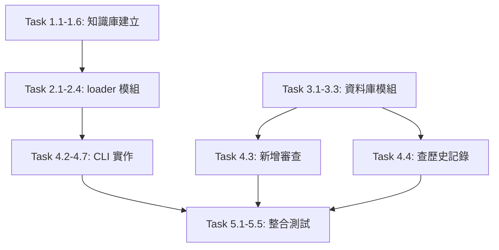

# nvidia-dde-to-dss-phase-a - 實作任務清單

## 階段 A.1: 建立知識庫結構 (預計 1 小時)

### Task 1.1: 建立 knowledge 目錄樹
- [ ] 建立 `knowledge/roles/` 目錄
- [ ] 建立 `knowledge/standards/` 目錄
- [ ] 建立 `knowledge/risk_templates/` 目錄
- [ ] 在 `standards/` 與 `risk_templates/` 建立 `.gitkeep` 檔案

**驗收條件**:
```bash
tree knowledge/
# 應顯示：
# knowledge/
# ├── roles/
# ├── standards/
# │   └── .gitkeep
# └── risk_templates/
#     └── .gitkeep
```

### Task 1.2: 匯出 Risk-Analyst 角色設定
- [ ] 從 `design_decision_engine.py` 的 `ROLES[0]` 複製內容
- [ ] 建立 `knowledge/roles/risk_analyst.json`
- [ ] 驗證 JSON 格式正確

**檔案內容**:
```json
{
  "id": "deepseek-ai/deepseek-v3.2",
  "name": "Risk-Analyst",
  "system": "你是專精安全性與風險分析的資深架構師。請只輸出 JSON，不要任何說明文字。",
  "focus_fields": ["risks", "verdict"],
  "focus_desc": "主責 risks（含 level/issue/suggestion），若審查中發現重要的 missing 或 improvements 也可少量補充"
}
```

### Task 1.3: 匯出 Completeness-Reviewer 角色設定
- [ ] 從 `design_decision_engine.py` 的 `ROLES[1]` 複製內容
- [ ] 建立 `knowledge/roles/completeness_reviewer.json`
- [ ] 驗證 JSON 格式正確

### Task 1.4: 匯出 Improvement-Advisor 角色設定
- [ ] 從 `design_decision_engine.py` 的 `ROLES[2]` 複製內容
- [ ] 建立 `knowledge/roles/improvement_advisor.json`
- [ ] 驗證 JSON 格式正確

### Task 1.5: 建立 Aggregator 角色設定
- [ ] 從 `design_decision_engine.py` 提取 `AGGREGATOR_MODEL` 常數
- [ ] 參考 `main()` 中的 Aggregator prompt
- [ ] 建立 `knowledge/roles/aggregator.json`

**檔案內容**:
```json
{
  "id": "nvidia/llama-3.1-nemotron-ultra-253b-v1",
  "name": "Aggregator",
  "system": "你是資深首席架構師，負責整合各專家意見並做最終裁決。只輸出 JSON，不要任何說明文字。",
  "focus_fields": ["risks", "missing", "improvements", "good_points", "verdict"],
  "focus_desc": "整合所有專家意見，去重、排序、裁決衝突，輸出最終報告"
}
```

### Task 1.6: 驗證知識庫完整性
- [ ] 使用 `jq` 或 Python 驗證所有 JSON 檔案格式
- [ ] 確認 4 個角色檔案都存在
- [ ] 執行一次 `pytest test_engine.py -v` 確保未破壞現有功能

---

## 階段 A.2: 建立載入模組 (預計 0.5 小時)

### Task 2.1: 建立 engine/loader.py
- [ ] 建立 `engine/` 目錄
- [ ] 建立 `engine/__init__.py`（空檔案）
- [ ] 建立 `engine/loader.py`

**核心函數**:
- `get_knowledge_base_path() -> Path`
- `load_role(filename: str) -> Dict`
- `load_roles() -> List[Dict]`

### Task 2.2: 實作 fallback 機制
- [ ] 在 `loader.py` 中定義 `BUILTIN_ROLES` 常數
- [ ] 實作檔案讀取失敗時的 fallback 邏輯
- [ ] 新增適當的警告訊息（使用 `print` 或 `warnings`）

### Task 2.3: 編寫 loader 單元測試
- [ ] 建立 `test_loader.py`
- [ ] 測試 `load_roles()` 能正確載入 4 個角色
- [ ] 測試當 `knowledge/` 不存在時能 fallback 到內建值
- [ ] 測試 JSON 格式錯誤時的處理

**測試案例**:
```python
def test_load_roles_success():
    """測試成功載入角色"""
    roles = load_roles()
    assert len(roles) == 3  # 3 位專家
    
def test_load_roles_fallback():
    """測試找不到 knowledge/ 時的 fallback"""
    # 暫時移動 knowledge/ 目錄
    roles = load_roles()
    assert roles == BUILTIN_ROLES
```

### Task 2.4: 文件與註解
- [ ] 為所有公開函數新增 docstring
- [ ] 新增型別提示（type hints）
- [ ] 註解關鍵邏輯

---

## 階段 A.3: 建立資料庫模組 (預計 0.5 小時)

### Task 3.1: 建立 db/schema.sql
- [ ] 建立 `db/` 目錄
- [ ] 建立 `db/schema.sql`
- [ ] 定義 `reviews` 表格結構
- [ ] 建立索引與觸發程序

**SQL 內容**:
```sql
CREATE TABLE IF NOT EXISTS reviews (
    id          INTEGER PRIMARY KEY AUTOINCREMENT,
    project     TEXT NOT NULL,
    reviewed_at TEXT NOT NULL,
    risk_high   INTEGER DEFAULT 0,
    risk_medium INTEGER DEFAULT 0,
    risk_low    INTEGER DEFAULT 0,
    verdict     TEXT,
    result_json TEXT NOT NULL
);

CREATE INDEX IF NOT EXISTS idx_reviews_reviewed_at ON reviews(reviewed_at);
CREATE INDEX IF NOT EXISTS idx_reviews_project ON reviews(project);
```

### Task 3.2: 建立 db/init_db.py
- [ ] 建立 `db/init_db.py`
- [ ] 實作 `init_database()` 函數
- [ ] 讀取並執行 `schema.sql`
- [ ] 新增執行結果回報（成功/失敗訊息）

**測試方式**:
```bash
python db/init_db.py
# 應顯示：
# 📍 資料庫路徑：/path/to/db/history.db
# ✅ 資料庫初始化成功！
```

### Task 3.3: 驗證資料庫結構
- [ ] 使用 `sqlite3` 命令檢查表格
- [ ] 確認索引已建立
- [ ] 測試插入一筆測試資料

```bash
sqlite3 db/history.db ".schema reviews"
sqlite3 db/history.db "SELECT * FROM reviews;"
```

---

## 階段 A.4: 建立互動式 CLI (預計 2 小時)

### Task 4.1: 安裝依賴套件
- [ ] 編輯 `requirements.txt`（若存在）或記錄依赖
- [ ] 執行 `pip install rich>=13.0 questionary>=2.0`
- [ ] 驗證安裝成功

```bash
python -c "import rich; import questionary; print('OK')"
```

### Task 4.2: 建立 cli.py 骨架
- [ ] 建立 `cli.py`
- [ ] 匯入必要的模組（rich, questionary, sqlite3）
- [ ] 建立 `main()` 主迴圈
- [ ] 實作基本選單結構

**最小可行產品**:
```python
from rich.console import Console
import questionary

console = Console()

def main():
    while True:
        choice = questionary.select(
            "請選擇功能：",
            choices=[
                "[1] 新增審查",
                "[2] 查歷史記錄",
                "[Q] 退出",
            ]
        ).ask()
        
        if choice.lower() == 'q':
            break

if __name__ == '__main__':
    main()
```

### Task 4.3: 實作「新增審查」功能
- [ ] 實作 `add_new_review()` 函數
- [ ] 詢問專案名稱
- [ ] 呼叫現有引擎（需重構 `main()` 回傳結果）
- [ ] 儲存結果至資料庫

**技術挑戰**:
- `design_decision_engine.main()` 目前只 print，需要：
  - Option A: 修改為回傳結果（但違反「零破壞」原則）
  - Option B: 攔截 stdout（複雜度高）
  - Option C: 抽出核心邏輯為新函數（推薦）

**建議方案**:
在 `design_decision_engine.py` 新增函數：
```python
def run_design_review(spec: str) -> dict:
    """
    執行設計審查並回傳結果
    
    Args:
        spec: 設計規格字串
        
    Returns:
        dict: Aggregator 輸出的完整 JSON
    """
    # 重用現有邏輯，但回傳而不是 print
```

### Task 4.4: 實作「查歷史記錄」功能
- [ ] 實作 `view_history()` 函數
- [ ] 連接 SQLite 資料庫
- [ ] 查詢最近 10 筆記錄
- [ ] 使用 Rich Table 顯示

**顯示欄位**:
- ID
- 專案名稱
- 審查時間
- 高風險數
- 中風險數
- 低風險數
- 裁決摘要

### Task 4.5: 實作「管理知識庫」功能
- [ ] 實作 `manage_knowledge_base()` 函數
- [ ] 顯示佔位訊息（Phase A 僅預覽）
- [ ] 列出未來功能

### Task 4.6: 美化 CLI 介面
- [ ] 套用暖感工業風格色彩
- [ ] 新增 Panel 邊框與標題
- [ ] 調整選單樣式（琥珀橙主題）
- [ ] 新增 emoji 圖示

**色彩配置**:
```python
STYLE_PRIMARY = "#F39C12"      # 琥珀橙
STYLE_BG = "#1A1A1B"           # 深炭黑
STYLE_SECONDARY = "#D35400"    # 深橙
```

### Task 4.7: 錯誤處理與使用者回饋
- [ ] 處理資料庫不存在的錯誤
- [ ] 處理知識庫載入失敗
- [ ] 新增操作成功的視覺回饋
- [ ] 新增進度指示器（审查執行中）

---

## 階段 A.5: 整合測試與除錯 (預計 1 小時)

### Task 5.1: 端到端測試流程
- [ ] 執行 `pytest test_engine.py -v` 確認原有測試全過
- [ ] 執行 `python db/init_db.py` 初始化資料庫
- [ ] 執行 `python cli.py` 啟動互動介面
- [ ] 測試選 [1] 新增審查
- [ ] 測試選 [2] 查歷史記錄
- [ ] 測試選 [Q] 退出系統

### Task 5.2: 驗證資料流程
- [ ] 確認審查結果正確寫入資料庫
- [ ] 確認歷史記錄能正確讀取
- [ ] 確認風險數量統計正確

**SQL 驗證**:
```sql
SELECT project, risk_high, risk_medium, risk_low 
FROM reviews 
ORDER BY reviewed_at DESC;
```

### Task 5.3: 边界情況測試
- [ ] 測試空專案名稱
- [ ] 測試資料庫鎖定時的處理
- [ ] 測試知識庫檔案損毀時的 fallback
- [ ] 測試網路斷線時的錯誤訊息

### Task 5.4: 效能檢查
- [ ] 測量 CLI 啟動時間（應 < 1 秒）
- [ ] 測量歷史記錄查詢時間（應 < 0.5 秒）
- [ ] 確認無記憶體洩漏

### Task 5.5: 文件更新
- [ ] 更新 `README.md` 增加 CLI 使用說明
- [ ] 新增 `CLI_USAGE.md`（可選）
- [ ] 更新安裝步驟（增加 rich + questionary）

---

## 驗收標準總覽

### ✅ 必須全部達成才能視為 Phase A 完成

| 編號 | 驗收項目 | 狀態 |
|------|---------|------|
| A-1 | `pytest test_engine.py -v` 全綠（5/5 passed） | ⬜ |
| A-2 | `python db/init_db.py` 成功建立 `db/history.db` | ⬜ |
| A-3 | `python cli.py` 能顯示主選單 | ⬜ |
| A-4 | 選 [1] 能觸發審查流程並寫入 DB | ⬜ |
| A-5 | 選 [2] 能列出歷史記錄（含時間、專案名、高風險數） | ⬜ |
| A-6 | 不修改 `design_decision_engine.py` 任何現有函數 | ⬜ |
| A-7 | ROLES 完全抽離至 `knowledge/roles/*.json` | ⬜ |
| A-8 | 新增依賴僅 rich + questionary | ⬜ |

---

## 任務依賴關係



---

## 預估工時總表

| 階段 | 任務數 | 預估工時 | 實際工時 | 差異 |
|------|--------|----------|----------|------|
| A.1 知識庫 | 6 | 1.0h | - | - |
| A.2 loader 模組 | 4 | 0.5h | - | - |
| A.3 資料庫模組 | 3 | 0.5h | - | - |
| A.4 CLI 實作 | 7 | 2.0h | - | - |
| A.5 整合測試 | 5 | 1.0h | - | - |
| **總計** | **25** | **5.0h** | **-** | **-** |

---

**任務狀態**: 待執行  
**建立日期**: 2026-04-03  
**最後更新**: 2026-04-03  
**版本**: 1.0
